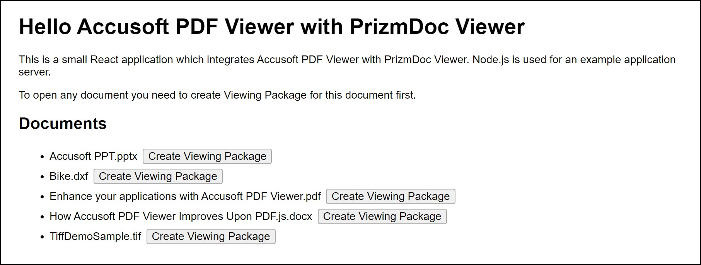

# Hello Accusoft PDF Viewer with PrizmDoc Viewer

A minimal example of a [React app](https://github.com/facebook/create-react-app)
which integrates the
[Accusoft PDF Viewer](https://www.npmjs.com/package/@accusoft/pdf-viewer) with
PrizmDoc Viewer.

## Setup

### Requirements

- [Node.js](https://nodejs.org) 14 or higher

### Configure Connection to PrizmDoc Server

Configure the example application server's connection to PrizmDoc Server by
editing the [server/config.json5](./server/config.json5) file
(this is just a JSON file with comments).

For a self-hosted PrizmDoc Server:

```json
{
  "prizmDocServerUrl": "YOUR_PRIZMDOC_SERVER_URL"
}
```

Alternately, you can set or override this value via the environment variable
`PRIZMDOC_SERVER_URL`.

_**IMPORTANT:** Make sure your self-hosted PrizmDoc Server version is 13.20 or
higher and the "v3" Viewing Packages feature is enabled.
See [the product documentation](https://help.accusoft.com/PrizmDoc/latest/HTML/integration-with-pdf-viewer.html)
for information about configuring PrizmDoc Server._

### (Optional) Configure Viewing Package Id Salt

The example application server uses a cryptographic hash to generate the
Viewing Package Id from the document name (this method is implemented
in [server/prizmDoc/packageId.js](./server/prizmDoc/packageId.js)).
Additionally, you can configure the salt value so that each developer or user has
their own separate packages. Configure the salt value by editing the
[server/config.json5](./server/config.json5) file:

```json
  "packageIdSalt": "YOUR_UNIQUE_SALT"
```

Alternately, you can set or override this value via the environment variable
`ACCUSOFT_PACKAGEID_SALT`.

### Install dependencies

```bash
npm install
```

## Running the Sample

```bash
npm start
```

This will:

1. Perform a production build of the React application in the `client` directory
2. Launch the example application server on `http://localhost:8888`

You should see output like this:

```bash
> server@1.0.0 start /mnt/data/code/hello-accusoft-pdf-viewer-with-prizmdoc-viewer/github/server
> node main.js

Application running at http://localhost:8888
```

When you open `http://localhost:8888` in a browser, you
should see a home page with a list of example documents, like this:



Next, you can create a Viewing Package for any document in the list and then
open it in the Accusoft PDF Viewer.

## Developing Using the Client Dev Server

The instructions above performed a production build of the React client code
and then started the application server using those pre-built client assets.

If you want to do development on the React application in the `client`
directory, you can get faster feedback on your changes by using the built-in
`create-react-app` development server, which supports automatic hot reloading
of changes in the browser as you make changes to the code.

Here is how to use the client dev server:

### 1. Make Sure the Example Application Server Is Started

First, make sure the application server is running (if it is not already):

```bash
cd server
npm start
```

This will launch the example application server on `http://localhost:8888`.

### 2. Start the Client React App in Dev Mode

Given the application server is already running at `http://localhost:8888`,
use a separate terminal window to start the client dev server like so:

```bash
cd client
npm start
```

This will launch the a client dev server at `http://localhost:3000` and open
the page in your browser.

The dev server (on port `3000`) is configured to proxy all unrecognized routes
to the application server (on port `8888`) so that the client can make REST API
calls to the application server (this proxy setting is configured in
[client/package.json](./client/package.json)).

## Building the Client for Production

To perform a production build of the client:

```bash
cd client
npm run build
```

This will create production client-side assets in `client/build`.
